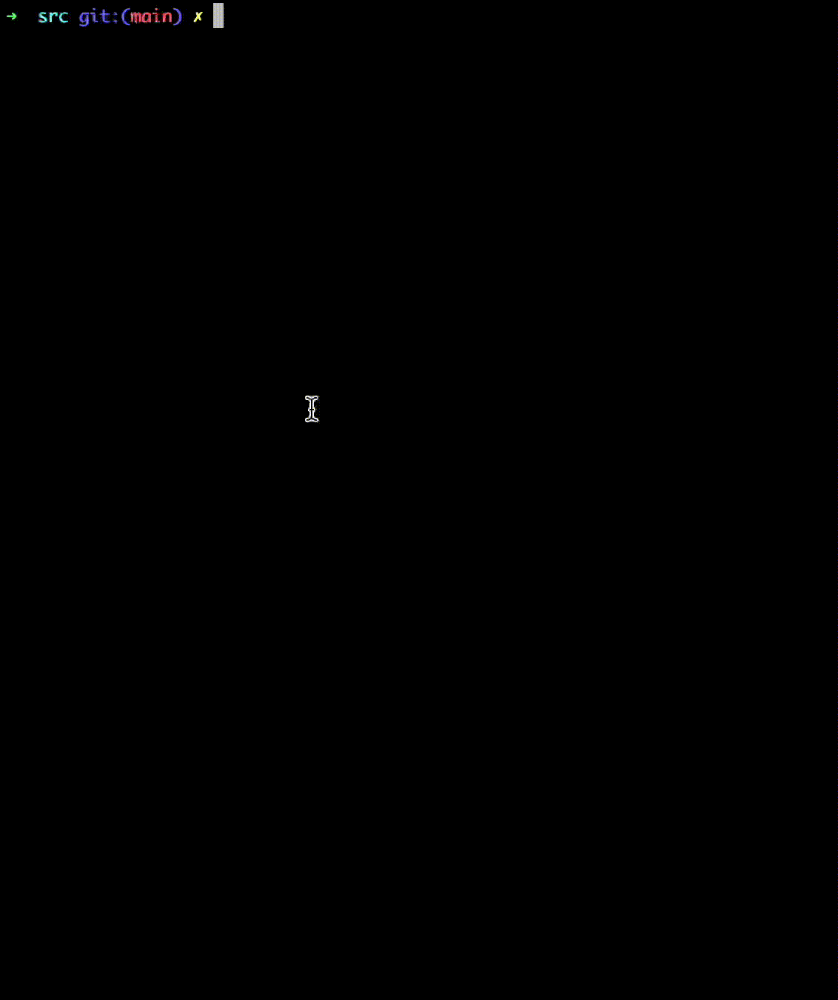

# Table of Contents
- [1 - Goal](#1---goal)
- [2 - Analysing the subject](#2---analysing-the-subject)
	- [2.1 - Requirements](#21---requirements)
	- [2.2 - Note #1 - Display a string, not char by char](#22---note-1---display-a-string-not-char-by-char)
	- [2.3 - Note #2 - Communication between server and client (two way channel)](#23---note-2---communication-between-server-and-client-two-way-channel)
- [3 - Implementation](#3---implementation)
	- [3.1 - Allowed functions](#31---allowed-functions)
		- [3.1.1 - Libft](#311---libft)
		- [3.1.2 - Other functions](#312---other-functions)
- [4 - Testing](#4---testing)
	- [4.1 - Testers](#41---testers)
	- [4.2 - Result](#42---result)
- [5 - Demo](#5---demo)
- [6 - Resources](#6---resources)


# 1 - Goal
The purpose of this project is to code a small data exchange program using UNIX signals.

# 2 - Analysing the [subject](pdf/42cursus_Minitalk_v2.pdf)

## 2.1 - Requirements

>You must create a communication program in the form of a client and a server.
>- The server must be started first. After its launch, it has to print its PID.
>- The client takes two parameters: 1) The server PID 2) The string to send.
>- The client must send the string passed as a parameter to the server. Once the string has been received, the server must print it.
>- The server has to display the string pretty quickly. Quickly means that if you think it takes too long, then it is probably too long.
>- Your server should be able to receive strings from several clients in a row without needing to restart.
>- The communication between your client and your server has to be done only using UNIX signals.
>- You can only use these two signals: SIGUSR1 and SIGUSR2.

## 2.2 - Note #1 - Display a string, not char by char

To be noted that as per the subject, it cannot be displayed char-by-char on the server-side, it must be displayed the whole message received instead:
> Once the string has been received, the server must print it.

Therefore, it must be known in advance the length of the message so the server can allocate memory in the heap as required only once (best approach). Or alternatively, don't send the lenght and keep modifying the allocation in memory - joining a char to already received string - till receiving the last char (not so good approach since will have to repeat allocation for every new char received).
The following functions from `libft` could be used:
- `ft_strlen()`, to know the length of the message to be sent from client to server
- `ft_calloc()`, in order to save the chars being received till the string is completed received on server side, so it can be then displayed

## 2.3 - Note #2 - Communication between server and client (two way channel)

>- The server has to display the string pretty quickly. Quickly means that if you think it takes too long, then it is probably too long.

Researching about the theme, two options arise: 

- using a delay function like `sleep()` or `usleep()` avoiding the communication of signals back and forward between server/client, which would impose a delay per char, since we would be sending in blind way (no feedback loop) chars from client to server. Depending on the delay set signals could queue.

- the other option would be to implement a feedback loop so whenever client sends a char to server, it waits till server sends back a ACK signal informing client that the next bit can be sent. This later solution should be a lot quicker since there would be no delay function. This solution is aligned with the bonus: `The server acknowledges every message received by sending back a signal to the client.`

As noted on the subject, there should not be sent signals blindly, making the two-way communication the best implementation.
> Linux system does NOT queue signals when you already have pending signals of this type!  Bonus time?


# 3 - Implementation

## 3.1 - Allowed functions

### 3.1.1 - Libft

The subject states that [libft](https://github.com/pvaladares/42cursus-00-Libft) library can be used!
> You can definitely use your libft.

Reading the subject it can be understood some functions included in the `libft` will be required to fulfill the requirements, as shown below:
> The server must be started first. After its launch, it has to print its PID.
> - The client takes two parameters:
>     - The server PID.
>     - The string to send.
- `ft_atoi()`, to convert the PID argument received from command line to integer type for further processing of signal processing

### 3.1.2 - Other functions

Below is made a brief analysis of other functions that can be used.

> In order to complete the mandatory part, you are allowed to use the following functions:
> - write
> - [ft_printf](https://github.com/pvaladares/42cursus-01-ft_printf) and any equivalent YOU coded 
> - signal
```c
sig_t signal(int sig, sig_t func);
```
```man
This signal() facility is a simplified interface to the more general sigaction(2) facility.
(...)
some signals instead cause the process receiving them to be stopped, or are simply discarded
if the process has not requested otherwise.  
Except for the SIGKILL and SIGSTOP signals, the signal() function allows for a signal to be 
caught, to be ignored, or to generate an interrupt.
These signals are defined in the file <signal.h>:

           Name             Default Action       Description
     1     SIGHUP           terminate process    terminal line hangup
     2     SIGINT           terminate process    interrupt program 
(...)
     30    SIGUSR1          terminate process    User defined signal 1
     31    SIGUSR2          terminate process    User defined signal 2  

The sig argument specifies which signal was received.  
The func procedure allows a user to choose the action upon receipt of a signal.

The handled signal is unblocked when the function returns and the process continues 
from where it left off when the signal occurred.

For some system calls, if a signal is caught while the call is executing and the call is 
prematurely terminated, the call is automatically restarted.  
Any handler installed with signal(3) will have the SA_RESTART flag set, 
meaning that any restartable system call will not return on receipt of a signal.  

The affected system calls include read(2), write(2), sendto(2), recvfrom(2), sendmsg(2), 
and recvmsg(2) on a communications channel or a low speed device and during a ioctl(2) or wait(2).
However, calls that have already committed are not restarted, but instead return a partial success
(for example, a short read count).  
These semantics could be changed with siginterrupt(3).
     
See sigaction(2) for a list of functions that are considered safe for use in signal handlers.

The previous action is returned on a successful call.  
Otherwise, SIG_ERR is returned and the global variable errno is set to indicate the error.
     
macOS 12.4                      June 7, 2004                      macOS 12.4
```

> - sigemptyset
> - sigaddset
```c
int sigemptyset(sigset_t *set);
int sigaddset(sigset_t *set, int signo);
```
```man
These functions manipulate signal sets, stored in a sigset_t.
sigemptyset() must be called for every object of type sigset_t before any other use of the object.

The sigemptyset() function initializes a signal set to be empty.

The sigaddset() function adds the specified signal signo to the signal set.

These functions are provided as macros in the include file <signal.h>.
Actual functions are available if their names are undefined (with #undef name).

Functions return 0.

macOS 12.4          June 4, 1993          macOS 12.4
```

> - sigaction
```c
#define sa_handler      __sigaction_u.__sa_handler
#define sa_sigaction    __sigaction_u.__sa_sigaction

int sigaction(int sig, const struct sigaction *restrict act, struct sigaction *restrict oact);
```

```man
The system defines a set of signals that may be delivered to a process.
Signal delivery resembles the occurrence of a hardware interrupt: 
the signal is normally blocked from further occurrence, the current process
context is saved, and a new one is built.  
A process may specify a handler to which a signal is delivered, or specify that 
a signal is to be ignored.
A process may also specify that a default action is to be taken by the
system when a signal occurs.  
A signal may also be blocked, in which case its delivery is postponed until it is unblocked.  
The action to be taken on delivery is determined at the time of delivery.  
Normally, signal handlers execute on the current stack of the process.  
This may be changed, on a per-handler basis, so that signals are taken on a special signal stack.

The sigaction() system call assigns an action for a signal specified by sig.  
If act is non-zero, it specifies an action (SIG_DFL, SIG_IGN, or a handler routine) and mask 
to be used when delivering the specified signal.
If oact is non-zero, the previous handling information for the signal is returned to the user.

Options may be specified by setting sa_flags.  The meaning of the various bits is as follows:

           (...)

           SA_NODEFER      If this bit is set, further occurrences of the
                           delivered signal are not masked during the execution
                           of the handler.

           SA_RESETHAND    If this bit is set, the handler is reset back to
                           SIG_DFL at the moment the signal is delivered.

           SA_RESTART      See paragraph below.
           
           SA_SIGINFO      If this bit is set, the handler function is assumed
                           to be pointed to by the sa_sigaction member of struct
                           sigaction and should match the prototype shown above
                           or as below in EXAMPLES.  This bit should not be set
                           when assigning SIG_DFL or SIG_IGN.
                           
If a signal is caught during the system calls listed below, the call may be
forced to terminate with the error EINTR, the call may return with a data
transfer shorter than requested, or the call may be restarted.  
Restart of pending calls is requested by setting the SA_RESTART bit in sa_flags.  
The affected system calls include (...), write(2) and (...) on a communications channel or a
slow device (such as a terminal, but not a regular file) and during a wait(2) or (...).  
However, calls that have already committed are not restarted, but instead return a partial success 
(for example, a short read count).

NOTE
     The sa_mask field specified in act is not allowed to block SIGKILL or
     SIGSTOP.  Any attempt to do so will be silently ignored.

     The following functions are either reentrant or not interruptible by
     signals and are async-signal safe.  Therefore applications may invoke them,
     without restriction, from signal-catching functions:

     Base Interfaces:

     (...), getpid(), (...), kill(), (...), pause(), (...), sigaction(), sigaddset(), (...),
     sigemptyset(), (...), signal(), (...), sleep(), (...), wait(), (...), write().

     Realtime Interfaces:

     aio_error(), sigpause(), aio_return(), aio_suspend(), sem_post(), sigset().

     ANSI C Interfaces:

     strcpy(), strcat(), strncpy(), strncat(), and perhaps some others.
     
     Extension Interfaces:

     strlcpy(), strlcat().

     All functions not in the above lists are considered to be unsafe with
     respect to signals.  That is to say, the behaviour of such functions when
     called from a signal handler is undefined.  In general though, signal
     handlers should do little more than set a flag; most other actions are not
     safe.

     Also, it is good practice to make a copy of the global variable errno and
     restore it before returning from the signal handler.  This protects against
     the side effect of errno being set by functions called from inside the
     signal handler.
```
> - kill

Using `kill()` to check the PID server input

```man
DESCRIPTION
     The kill() function sends the signal specified by sig to pid, a process or
     a group of processes.  Typically, Sig will be one of the signals specified
     in sigaction(2).  A value of 0, however, will cause error checking to be
     performed (with no signal being sent).  This can be used to check the
     validity of pid.
````
  
This is a nice finding to check the validity of the PID in a robust way, rather than just checking if all the chars are digits.
```c
else if (kill(ft_atoi(argv[1]), 0) < 0)
{
	ft_putstr_fd("\e[31m## error - PID is invalid ##\n\e[0m", STDOUT_FILENO);
	return (EXIT_FAILURE);
}
```
  
```man
     If pid is greater than zero:
             Sig is sent to the process whose ID is equal to pid.

     If pid is zero:
             Sig is sent to all processes whose group ID is equal to the process
             group ID of the sender, and for which the process has permission;
             this is a variant of killpg(2).

     If pid is -1:
             If the user has super-user privileges, the signal is sent to all
             processes excluding system processes and the process sending the
             signal.  If the user is not the super user, the signal is sent to
             all processes with the same uid as the user, excluding the process
             sending the signal.  No error is returned if any process could be
             signaled.
```         
    

> - getpid

```c
pid_t getpid(void);
```
```man
DESCRIPTION
     getpid() returns the process ID of the calling process.  The ID is
     guaranteed to be unique and is useful for constructing temporary file
     names.
```

> - malloc
> - free
> - pause
```c
int pause(void);
```
```man
DESCRIPTION
     The pause() function causes the calling thread to pause until a signal is
     received from either the kill(2) function or an interval timer.  (See
     setitimer(2).) Upon termination of a signal handler started during a
     pause(), the pause() call will return.
```
> - sleep
> - usleep
```c
int usleep(useconds_t microseconds);
```
```man
DESCRIPTION
     The usleep() function suspends execution of the calling thread until either
     microseconds have elapsed or a signal is delivered to the
     thread and its action is to invoke a signal-catching function or to
     terminate the process.  System activity or limitations may lengthen the
     sleep by an indeterminate amount.

     This function is implemented using nanosleep(2) by pausing for microseconds
     microseconds or until a signal occurs.  Consequently, in this
     implementation, sleeping has no effect on the state of process timers, and
     there is no special handling for SIGALRM.  Also, this implementation does
     not put a limit on the value of microseconds (other than that limited by
     the size of the useconds_t type); some other platforms require it to be
     less than one million.
```
> - exit
```man
DESCRIPTION
     The exit() function terminates a process.

     Before termination, exit() performs the following functions in the order
     listed:

           1.   Call the functions registered with the atexit(3) function, in
                the reverse order of their registration.

           2.   Flush all open output streams.

           3.   Close all open streams.

           4.   Unlink all files created with the tmpfile(3) function.

     Function make the low-order eight bits of the status argument available to 
     a parent process which has called a wait(2)-family function.
     
     The C Standard (ISO/IEC 9899:1999 (“ISO C99”)) defines the values 0,
     EXIT_SUCCESS, and EXIT_FAILURE as possible values of status.
```


# 4 - Testing

## 4.1 - Testers
- [xicodomingues / francinette](https://github.com/xicodomingues/francinette)
  
## 4.2 - Result
 

# 5 - Demo

 

- Below is a demonstration of the usage of the `server` and `client` programs
	- Erro handling, e.g. incorrect number of arguments and invalid PID server
	- Sending empty messages with `""` and `''` - transmission of empty message is received by server (length 0) and displayed
	- Sending Large message sent +1000 chars using [Lorem Ipsum site](https://lipsum.com/feed/html)
	- Receiving a message from a 2nd client after 1st client (in a row)
	- Client showing transmission log

# 6 - Resources
- [Sending and Handling Signals in C (kill, signal, sigaction)](https://www.youtube.com/watch?v=83M5-NPDeWs)
- [Communicating between processes using signals](https://www.youtube.com/watch?v=PErrlOx3LYE)
- [Good reading about how to approach the project](https://github.com/mlanca-c/Minitalk/wiki)
- [Checking for Pending Signals](https://www.gnu.org/software/libc/manual/html_node/Checking-for-Pending-Signals.html)
- [Introduction To Unix Signals Programming](http://www.cs.kent.edu/~ruttan/sysprog/lectures/signals.html) and [SIGACTION](http://www.cs.kent.edu/~ruttan/sysprog/lectures/signals/sigaction.html)
